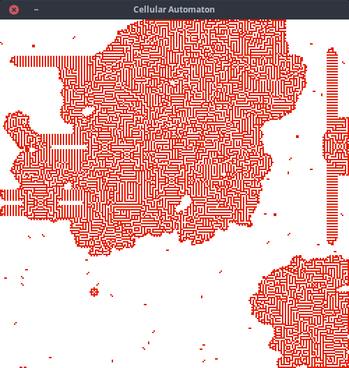

# Cellular Automaton
Cellular automaton implemented with SDL

 

Compile
------------

    make

Usage
----------

    ./CA

Press `P`  to play the animation. 

TODO
----------

- Add options
- Refactor the code
- parse rule file
- add Moore neighborhood
- and more ...